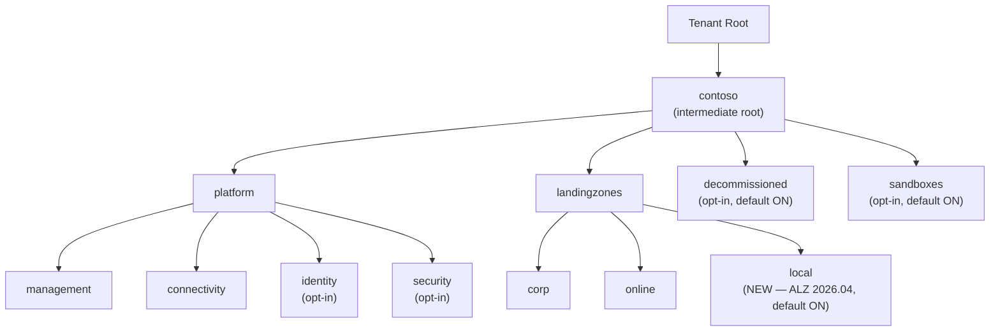

The core `foundation` module deploys a hub-spoke landing zone — either into **one subscription** (`single` mode, the default) or **across three subscriptions** (`multi` mode, ALZ-aligned — see [Multi-subscription](/azure-launchpad/scenarios/multi-subscription/)). In both cases, no Management Groups (MGs) are created. For most SMB customers that's the right starting point.

If you want ALZ-aligned governance — tenant-scoped policy assignments, MG-based RBAC, and an upgrade path to enterprise ALZ — deploy the **separate, opt-in** `management-groups` root module from this repo. It pairs cleanly with either foundation mode.

## Why a separate module?

- **Different scope.** MGs live at tenant root; the foundation lives in subscriptions. Mixing them would force every customer to grant tenant-root permissions just to deploy a hub-spoke.
- **Different blast radius.** MG and policy changes affect every subscription beneath them.
- **Different state.** Stored under a different backend key (`management-groups.<scenario>.tfstate`).
- **Different RBAC.** The deploying principal needs `Management Group Contributor` (and `Resource Policy Contributor` for policies) at Tenant Root — not just Contributor on a sub.

## Hierarchy (SMB-friendly defaults)



The `local` MG was added in [ALZ 2026.04](https://techcommunity.microsoft.com/blog/azuregovernanceandmanagementblog/new-local-management-group-for-alz--updated-sovereign-policies-for-slz/4515156) for workloads on (or migratable to) Azure Local disconnected operations.

## Toggles

| Variable                   | Default | Effect                                   |
| -------------------------- | ------- | ---------------------------------------- |
| `enable_identity_mg`       | `false` | Add `platform/identity`                  |
| `enable_security_mg`       | `false` | Add `platform/security`                  |
| `enable_local_mg`          | `true`  | Add `landingzones/local`                 |
| `enable_decommissioned_mg` | `true`  | Add `decommissioned` parking lot         |
| `enable_sandboxes_mg`      | `true`  | Add `sandboxes`                          |
| `enable_policies`          | `false` | Master switch for all policy assignments |

## Pairing with the foundation

The MG hierarchy is independent of how the `foundation` module is deployed, but the placement story differs.

### Single-sub foundation

You have one subscription holding everything (hub, spoke, monitor, backup). Place it under `corp` (workloads-with-corporate-connectivity), `online` (internet-facing workloads), or `local` (Azure Local) depending on the workload's egress and connectivity profile:

```hcl
subscription_placements = {
  "00000000-0000-0000-0000-000000000099" = "corp"   # the single foundation sub
}
```

### Multi-sub foundation (recommended)

The three foundation subs map **directly** to the ALZ MG slots they were named after — this is the whole point of multi-sub mode:

```hcl
subscription_placements = {
  "11111111-1111-1111-1111-111111111111" = "connectivity"   # foundation connectivity sub
  "22222222-2222-2222-2222-222222222222" = "management"     # foundation management sub
  "33333333-3333-3333-3333-333333333333" = "corp"           # foundation landing-zone sub
}
```

Use `online` instead of `corp` for the landing-zone sub if it hosts internet-facing workloads with no on-prem dependency, or `local` if it's an Azure Local edge sub. For multiple landing zones, place each LZ sub under whichever of `corp` / `online` / `local` matches its connectivity model.

| Foundation layer | Default MG | Why                                                     |
| ---------------- | ---------- | ------------------------------------------------------- |
| Connectivity     | `connectivity` | Inherits `Connectivity` policy initiative + RBAC    |
| Management       | `management`   | Inherits `Management` policy initiative + RBAC      |
| Landing-Zone     | `corp`         | Default for workloads with hub-routed connectivity  |
| (future) Identity | `identity`    | Requires `enable_identity_mg = true`                |

> **Order of operations.** Deploy `foundation` *first*, then `management-groups`. Moving a sub under an MG is non-disruptive — it doesn't touch resources, just changes the parent for inheritance. You can also flip the order if you prefer policies in place before workloads land.

## Subscription placement reference

Move existing subscriptions under MGs by adding entries to `subscription_placements`:

```hcl
subscription_placements = {
  "00000000-0000-0000-0000-000000000001" = "connectivity"
  "00000000-0000-0000-0000-000000000002" = "management"
  "00000000-0000-0000-0000-000000000003" = "corp"
}
```

Valid MG keys: `root`, `platform`, `management`, `connectivity`, `identity`, `security`, `landingzones`, `corp`, `online`, `local`, `decommissioned`, `sandboxes`.

## Policies

Policy assignments are **opt-in** and **fully customer-driven** — see the [Policy catalog](/azure-launchpad/governance/policy-catalog/) for the recommended list of ALZ-aligned built-in initiatives you can assign at each MG level.

## Deploy

```bash
cd infra/terraform/management-groups

terraform init \
  -backend-config="resource_group_name=$TFSTATE_RG" \
  -backend-config="storage_account_name=$TFSTATE_SA" \
  -backend-config="container_name=tfstate" \
  -backend-config="key=management-groups.minimal.tfstate"

TF_VAR_subscription_id=$ARM_SUBSCRIPTION_ID \
TF_VAR_tenant_id=$ARM_TENANT_ID \
  terraform plan -var-file=scenarios/minimal.tfvars
```

Apply when you're happy with the plan.

> **State location.** The `management-groups` module deploys no subscription-scoped resources — `subscription_id` is just the home for the azurerm provider session. In multi-sub setups, point it at the **management** sub for state colocation with the rest of the platform.

## Upgrade path

Once you've deployed `management-groups`:

- **Single-sub foundation**: place the foundation sub under `corp` / `online` / `local` via `subscription_placements`.
- **Multi-sub foundation**: place all three subs under `connectivity` / `management` / `corp` (or `online` / `local`) — the layout the foundation was already designed for.

Policy guardrails inherited from the MG hierarchy will apply automatically. To grow toward enterprise ALZ later, flip `enable_identity_mg` / `enable_security_mg` and assign more initiatives — no foundation re-deploy required.
