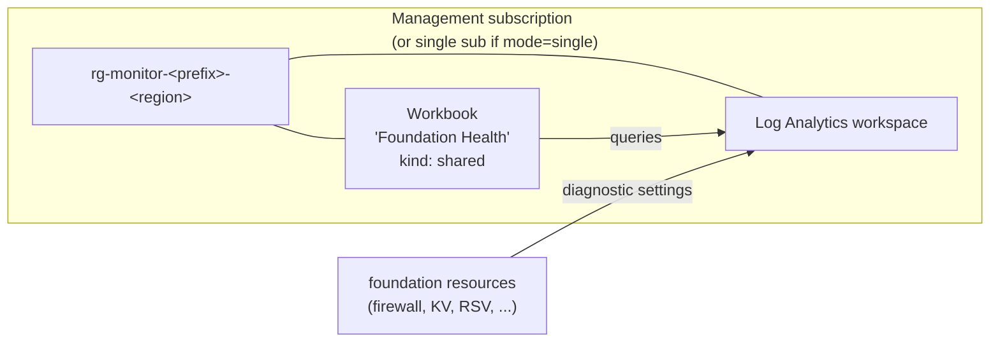

The **Foundation Health workbook** is a starter [Azure Monitor workbook](https://learn.microsoft.com/azure/azure-monitor/visualize/workbooks-overview) that ships with the foundation. It deploys into the monitoring resource group and is scoped to the foundation Log Analytics workspace.

It's **opt-in** and **off by default** — the workbook resource itself is free, but the queries inside it run against your LAW data. That data is already paid for by the foundation, but the workbook may surface ingestion you didn't realise you had.

> **TL;DR.** Set `workbook_enabled = true` (Terraform) or `workbookEnabled = true` (Bicep), redeploy, then open *Azure Monitor → Workbooks → Foundation Health* in the portal. Works in both `single` and `multi` deployment modes (it lands in the management sub in multi-sub mode).

## Where it lands



In `multi` mode, the workbook lands in the **management** sub — the same sub the LAW lives in. The workbook can only query the LAW it was deployed against, so co-location is required.

## What it deploys

One `Microsoft.Insights/workbooks` resource (`kind: shared`) in `rg-monitor-<prefix>-<region>`, with four tabs and a `TimeRange` parameter at the top that lets you pivot from 1h to 7d.

| Tab                      | KQL source                                          | Empty when…                                           | What to look for                                         |
| ------------------------ | --------------------------------------------------- | ----------------------------------------------------- | -------------------------------------------------------- |
| **Workspace ingestion**  | `Usage` table grouped by `DataType`                 | Brand-new LAW (give it ~15 min)                       | Which diagnostic settings are actually emitting GB/day  |
| **Firewall denies**      | `AZFWNetworkRule` where `Action == "Deny"`          | `baseline` / `vpn` (no firewall)                      | Top denied src/dst — usually misconfigured app rules    |
| **Key Vault operations** | `AzureDiagnostics` filtered to `MICROSOFT.KEYVAULT` | KV diag setting wasn't auto-applied (rare)            | Last 50 ops with caller — useful for audit + RCA        |
| **Backup job status**    | `AddonAzureBackupJobs` summarised by `JobStatus`    | No backup item is being protected yet                 | Job success rate over the time window                   |

## Why opt-in?

Two reasons:

1. **Doesn't fit every team.** Some shops bring their own workbooks, Grafana, or Datadog. We don't want to leave behind orphaned Azure resources for those teams.
2. **Editable starter, not a finished product.** This is intentionally minimal — it's meant to be cloned and extended, not used as-is.

## Enable it

### Terraform

Whether you're in `single` or `multi` mode, the toggle is the same:

```hcl
# wizard.auto.tfvars (or terraform.tfvars)
workbook_enabled = true
```

Then `terraform apply`. The output `workbook_id` will be populated with the new workbook's resource ID.

### Bicep

```bicep
// scenarios/<your>.bicepparam
param workbookEnabled = true
```

Then `az deployment sub create --parameters scenarios/<your>.bicepparam`. The output `workbookId` will be populated.

### Multi-sub Bicep

The workbook is part of the **management** layer template, so flip the param in `scenarios/management.bicepparam` and re-run only the management step of [`scripts/deploy-multi-sub.sh`](https://github.com/travishankins/azure-launchpad/blob/main/scripts/deploy-multi-sub.sh) — or re-run the whole wrapper (it's idempotent, the connectivity and landing-zone passes will be no-ops):

```bash
./scripts/deploy-multi-sub.sh \
  --connectivity-sub $CONN_SUB \
  --management-sub   $MGMT_SUB \
  --landingzone-sub  $LZ_SUB \
  --scenario full \
  --name-prefix contoso \
  --region westcentralus \
  --region-short wcus
```

## Editing the workbook content

The workbook content is two JSON files (one for each IaC tree) — keep them in sync if you edit one:

- [`infra/terraform/foundation/workbooks/foundation-health.workbook.json`](https://github.com/travishankins/azure-launchpad/blob/main/infra/terraform/foundation/workbooks/foundation-health.workbook.json)
- [`infra/bicep/foundation/workbooks/foundation-health.workbook.json`](https://github.com/travishankins/azure-launchpad/blob/main/infra/bicep/foundation/workbooks/foundation-health.workbook.json)

The easiest workflow:

1. Open the deployed workbook in the Azure portal.
2. Edit visually until you like it.
3. Click **Advanced editor** (`</>` icon) → copy the JSON.
4. Paste into **both** `foundation-health.workbook.json` files.
5. Commit. Next `terraform apply` / `az deployment sub create` will diff-update the deployed workbook.

> **Resource name is a GUID.** The workbook's `name` is a deterministic GUID derived from your naming suffix (Terraform: `uuidv5("dns", "azure-launchpad-workbook-<suffix>")`; Bicep: `guid('azure-launchpad-workbook', suffix)`). The display name (`Foundation Health`) is what you see in the portal — the GUID is just the resource ID, so editing in the portal won't create a duplicate on the next deploy.

## Suggested extensions

Common additions teams reach for once they've enabled the starter:

| Add a tab for…             | KQL starting point                                                                                  |
| -------------------------- | --------------------------------------------------------------------------------------------------- |
| Firewall **app** rule hits | `AZFWApplicationRule \| summarize count() by Fqdn, Action`                                          |
| NSG flow log denies        | `AzureNetworkAnalytics_CL \| where SubType_s == "FlowLog" and FlowStatus_s == "D"`                  |
| Heartbeat misses           | `Heartbeat \| summarize LastSeen=max(TimeGenerated) by Computer \| where LastSeen < ago(15m)`       |
| Sign-in failures (Entra)   | `SigninLogs \| where ResultType != 0` *(requires Entra → LAW diagnostic setting; not deployed here)* |
| Cost anomaly               | `AzureActivity \| where OperationNameValue startswith "MICROSOFT.CONSUMPTION/BUDGETS"`              |

The repo only ships the four core tabs to keep the starter readable. Add tabs in the portal, then export.

## Validation

```bash
cd infra/terraform/foundation
terraform test -filter=tests/workbook.tftest.hcl
# Success! 2 passed, 0 failed.
```

The plan-mode tests cover the disabled-by-default and enabled paths without needing Azure auth, and run as part of the standard CI matrix.

## Troubleshooting

### Workbook doesn't appear in *Azure Monitor → Workbooks*

It does deploy as `kind: shared` (visible to anyone with `Reader` on the RG). Check **Workbooks → Browse → Subscription filter** — the workbook lives in the management sub in multi-sub mode, not the connectivity or landing-zone sub.

### Tabs are empty

Most often the diagnostic settings on the source resources didn't take. Verify with:

```bash
az monitor diagnostic-settings list --resource <resource-id> -o table
```

The foundation auto-creates a diagnostic setting on every relevant resource (firewall, KV, RSV, NAT GW) pointing at the LAW resource ID. If that shows nothing, the resource hasn't been redeployed since you enabled the diagnostic settings — `terraform apply` again.

### "Failed to resolve workspace" on a tab

The hardcoded LAW reference in the workbook JSON points at a different LAW than the one in your deploy. The workbook content uses a `{Workspace}` parameter so this shouldn't happen, but if you imported a hand-edited workbook, check the `parameters` section of the JSON for a baked-in workspace ID and replace it with `{Workspace}`.

## Removal

Set `workbook_enabled = false` (or `workbookEnabled = false`) and re-apply. The workbook resource will be deleted; the LAW it queried is untouched.
