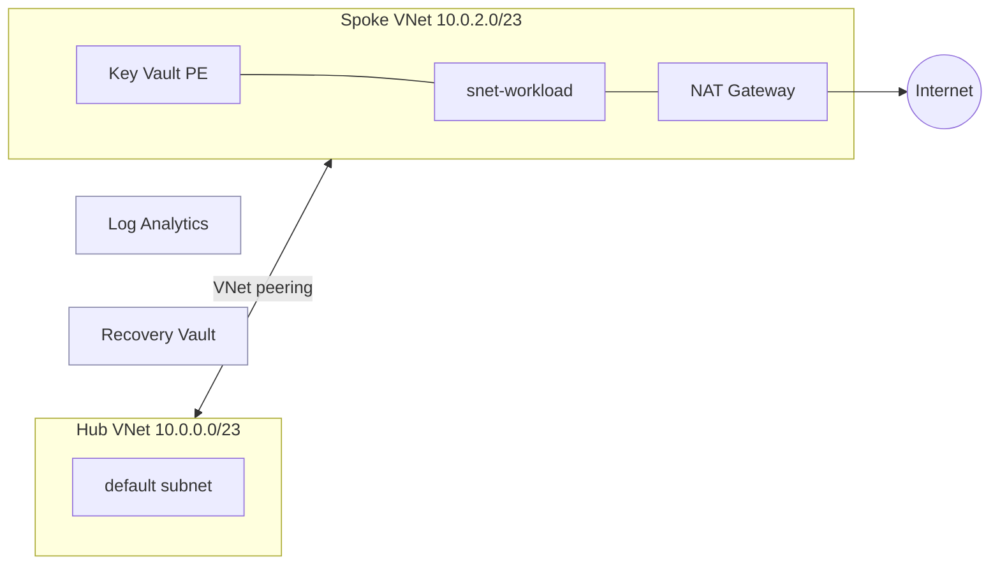
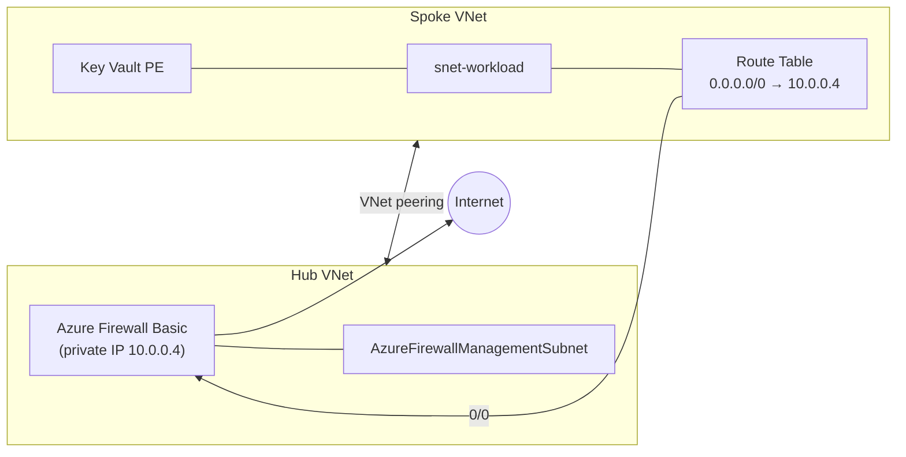
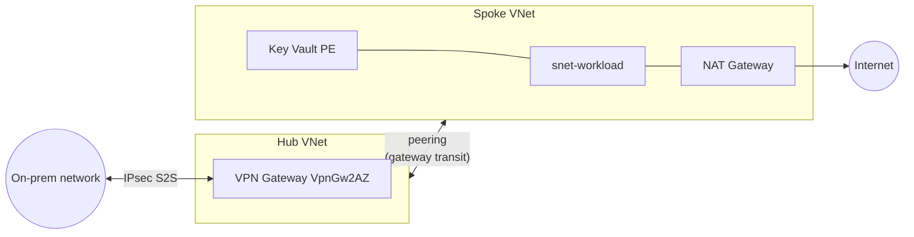
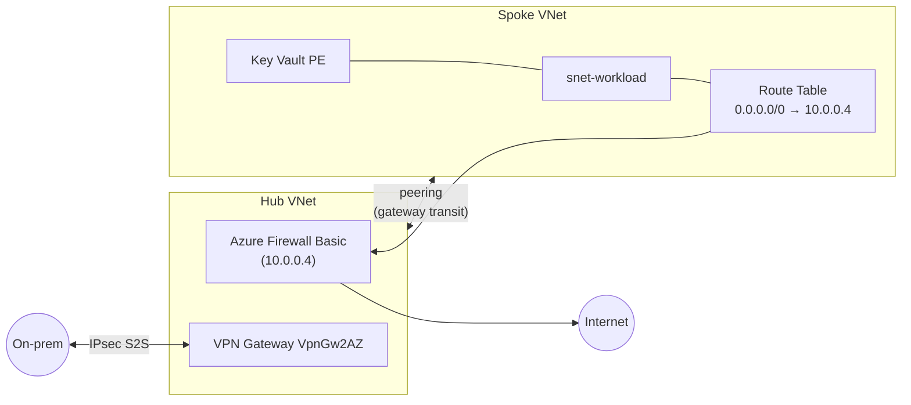

All four scenarios share the same hub-spoke topology and naming. The diagrams below show what changes between them.

## Address plan

| Network    | CIDR          | Subnets                                                                                                                                     |
| ---------- | ------------- | ------------------------------------------------------------------------------------------------------------------------------------------- |
| Hub VNet   | `10.0.0.0/23` | `AzureFirewallSubnet` (`/26`), `GatewaySubnet` (`/26`), `default` (`/26`), `AzureFirewallManagementSubnet` (`/26`, firewall scenarios only) |
| Spoke VNet | `10.0.2.0/23` | `snet-workload` (`/26`)                                                                                                                     |

## Scenarios at a glance

| Capability                            | baseline | firewall | vpn | full |
| ------------------------------------- | :------: | :------: | :-: | :--: |
| Hub + spoke VNets + peering           |    ✅    |    ✅    | ✅  |  ✅  |
| Spoke egress via NAT Gateway          |    ✅    |    —     | ✅  |  —   |
| Spoke egress via Azure Firewall       |    —     |    ✅    |  —  |  ✅  |
| Route Table 0/0 → firewall private IP |    —     |    ✅    |  —  |  ✅  |
| VPN Gateway (S2S to on-prem)          |    —     |    —     | ✅  |  ✅  |
| Gateway transit on peering            |    —     |    —     | ✅  |  ✅  |
| Key Vault + Private Endpoint          |    ✅    |    ✅    | ✅  |  ✅  |
| Log Analytics + Automation + RSV      |    ✅    |    ✅    | ✅  |  ✅  |

## Baseline

Spoke egresses to internet through its own NAT Gateway. Hub is mostly an empty VNet — present so future scenarios can promote in place without re-IP'ing.



## Firewall

Spoke egress is forced through Azure Firewall Basic in the hub. NAT Gateway is **not** deployed in the spoke — the firewall's public IPs are the egress identity.



## VPN

Spoke egresses to internet via NAT (same as baseline). On-prem reaches the spoke through a VPN Gateway in the hub. Peering uses **gateway transit**.



## Full

Both firewall and VPN. Spoke egress goes through the firewall; on-prem reaches the spoke through the VPN gateway via gateway transit.



## Module composition

```
infra/terraform/foundation/
├── terraform.tf            # required_providers + Azure backend
├── providers.tf            # azurerm + azapi configuration
├── variables.tf            # subscription_id, scenario, location, prefix, on-prem CIDRs
├── locals.tf               # scenario flags (use_firewall, use_vpn, use_nat, use_peering)
├── resource_groups.tf      # 6 RGs via for_each
├── modules.networking.tf   # VNets (AVM), NAT, peering, Private DNS
├── modules.security.tf     # Key Vault (AVM) + PE
├── modules.monitoring.tf   # Log Analytics + Automation + RSV (AVM)
├── modules.firewall.tf     # count = use_firewall — Firewall, mgmt subnet, route table
├── modules.vpn.tf          # count = use_vpn — VPN GW + PIP
├── outputs.tf
├── scenarios/*.tfvars      # one file per scenario
└── tests/*.tftest.hcl      # plan-mode assertions per scenario
```
