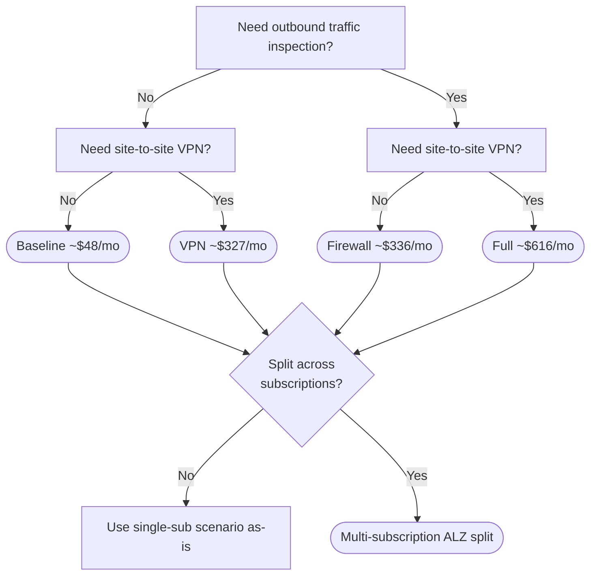

Not sure which scenario fits? Answer three questions.

## 1. Do you need outbound traffic inspection?

A central egress chokepoint that logs and (optionally) filters all internet-bound traffic from the spoke.

- **No** → start with **Baseline** or **VPN** (NAT Gateway only).
- **Yes** → use **Firewall** or **Full** (Azure Firewall Basic).

## 2. Do you need site-to-site (hybrid) connectivity?

A VPN Gateway that terminates an IPsec tunnel from the customer's on-prem network or another cloud.

- **No** → stick with **Baseline** or **Firewall**.
- **Yes** → use **VPN** or **Full** (adds a `VpnGw2AZ` gateway).

## 3. Single subscription or split across multiple?

- **Single subscription** → any of the four scenarios above land in one sub.
- **Connectivity / Management / Landing Zone in separate subs** → see [Multi-subscription (ALZ split)](/scenarios/multi-subscription/).

## Decision flow

## Quick reference

| If you need…                          | Pick                                              |
| ------------------------------------- | ------------------------------------------------- |
| Lowest cost, dev/test, small workload | [Baseline](/scenarios/baseline/)                  |
| Egress filtering / compliance         | [Firewall](/scenarios/firewall/)                  |
| Hybrid connectivity to on-prem        | [VPN](/scenarios/vpn/)                            |
| Both egress filtering and hybrid      | [Full](/scenarios/full/)                          |
| Separate subs per ALZ layer           | [Multi-subscription](/scenarios/multi-subscription/) |

Once you've picked a scenario, the [configuration generator](/wizard/) generates the matching `tfvars` or `bicepparam` file.
